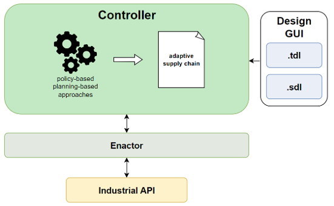
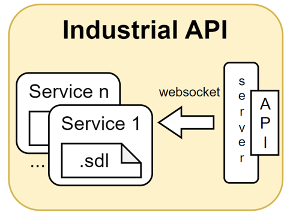
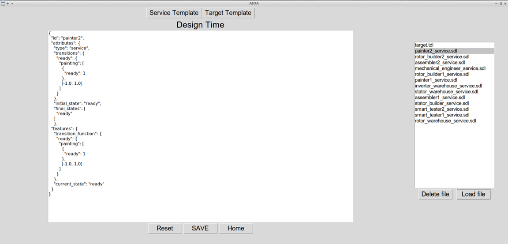

<div align="center">    

# Services in Industry 4.0. Modeling and composition @ SummerSOC 2023<br>AIDA


[](https://www.diag.uniroma1.it/gruppi-di-ricerca/25462)
[](./LICENSE)

</div>

AIDA (Adaptive InDustrial APIs) is a tool for the composition of Industrial APIs for resilience manufacturing. 

The proposed technique generates a plan for a manufacturing process by orchestrating manufacturing actors which are depicted as services.

## Architecture
<div align="center">    

</div>

- **Design GUI**: graphic tool to model manufacturing actors and goal
- **Controller**: composing the manufacturing actors
- **Enactor**: acting as a middleware between controller and Industrial API
- **Industrial API**: realizing the services wrapping the manufacturing actors

### IndustrialAPI
<div align="center">    

</div>

- The controller interact with the Industrial API through REST API to retrieve service specification and current status and request the execution of an action by a service.
- The services are connected to the server via websocket
- Services connect to the server to register and execute actions


## Preliminaries

We assume the user uses a **UNIX-like** machine and that has **Python 3.10** installed.

- To set up the virtual environment install [Pipenv](https://pipenv-fork.readthedocs.io/en/latest/) (<code>pip install pipenv</code>), then execute
```bash
pipenv install --dev
```

- Start a shell within the Python virtual environment (to be done whenever a new terminal is opened):
```bash
pipenv shell
```

- Install the Python package in development mode:
```bash
pip install -e .
```

- Install Graphviz to use rendering functionalities. 
  At [this page](https://www.graphviz.org/download/) you will find the releases for all the supported platform.

- Install [Lydia](https://github.com/whitemech/lydia). 
  We suggest to install it by [building it from source](https://github.com/whitemech/lydia#build-from-source).

- Install [xterm](https://invisible-island.net/xterm/).
```bash
sudo apt install xterm
```

- Install Python GUI Tkinter module:
```bash
sudo apt install python3-tk
```

- Install [Fast Downward](https://github.com/aibasel/downward) planner:
```bash
cd alto
git clone https://github.com/aibasel/downward.git
cd downward
./build.py
```

- Generate Python client from OpenAPI v3.0 specification (maybe you need to change permissions of the script file):
```bash
cd local/IndustrialAPI/actors_api_lmdp_ltlf/openapi_client_script
# chmod 777 generate-openapi-client.sh
./generate-openapi-client.sh

cd local/IndustrialAPI/actors_api_plan/openapi_client_script
# chmod 777 generate-openapi-client.sh
./generate-openapi-client.sh
```

## Run the tool
To run the tool you need to run the GUI script
```bash
cd GUI
python Adaptive.py
```

### Design time
<div align="center">    

</div>

A design time frame allows to model both services (.sdl) and manufacturing goal (.tdl). Such models are usually saved in specific folders inside [saved_models](GUI/saved_models/).

### Run time
<div align="center">    

</div>

A run time frame allows to generate and execute the optimal policy (plan). The set-up of this phase depends on the selection of a proper configuration file. [config_files](GUI/config_files/) contains some configuration files.


## Cite the tutorial
```bibtex
@misc{leotta2023services,
  title={{Service in Industry 4.0 modeling and composition}},
  author={Leotta, Francesco and 
    Mecella, Massimo and 
    Monti, Flavia and 
    Silo, Luciana},
  booktitle={Service-Oriented Computing 17th Symposium and Summer School,
    SummerSOC 2023, Hersonissos, Crete, Greece, June 26–July 1, 2023 - Tutorial Program},
  year={2023}
}
```

## Who are we?
We are part of the Processes, Services and Software Engineering group of DIAG (Sapienza Università di Roma).

The research team behind this work includes [Francesco Leotta](http://www.diag.uniroma1.it/leotta/), [Massimo Mecella](http://www.diag.uniroma1.it/users/massimo_mecella), [Flavia Monti](https://www.diag.uniroma1.it/users/flavia_monti) and [Luciana Silo](https://www.diag.uniroma1.it/users/luciana_silo).

## License
The software is released under the MIT license.
